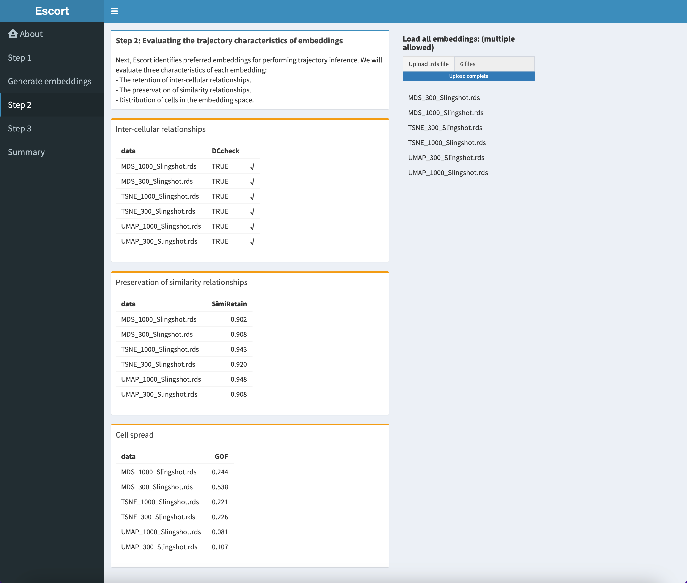

### Introduction
Welcome to shinyEscort, a user-friendly Shiny application designed to help researchers, even those without coding experience, in gaining deeper insights from their data. With shinyEscort, you can input your original data, normalized data, embeddings, and estimated trajectory, making it a valuable tool for understanding your data and obtaining accurate trajectory results.

### About
Discover how shinyEscort operates on the "About" tab positioned within the left column sidebar, offering insights into analysis choices such as feature selection, dimension reduction, and trajectory inference methods. 

### Step1
#### Input:
To initiate the analysis assessing the data's support for trajectory existence, users can click on the "Step 1" button in the left column sidebar. The user inputs cleaned raw and normalized single-cell RNA-seq data in preformatted CSV files and then click “Import” button. For hands-on practice, example datasets are stored in the data directory, featuring simulated scenarios such as homogeneous data, datasets with distinct cluster types, and linear topology datasets. In this demonstration, we utilize "rawcount_linear_splatter.csv" and "normcount_linear_splatter.csv" as illustrative examples, showcasing simulated scRNA-seq data with a linear structure in the screenshot.
#### Output:
**The number of cells and genes**  
Escort systematically checks the compatibility of normalized and raw datasets, ensuring they originate from the same dataset by assessing if they share identical dimensions. If they belong to the same dataset, the number of genes and cells within it is displayed, paving the way for the assessment of trajectory existence. In cases where the datasets do not align or if there is any missing input data, "NA" is displayed in the number of genes and cells. 
**UMAP and t-SNE representations**  
On the right side, UMAP and t-SNE representations provide a visual insight into the datasets.  
**Existence of trajectory**  
Two scenarios deemed inappropriate for trajectory fitting include cells from biologically distinct clusters and sets of cells with insufficient heterogeneity. These outcomes are presented in result boxes labeled "Diverse cell types" and "Homogeneous cells." The determination of trajectory existence is displayed above the UMAP and t-SNE representations.
* **Diverse cell types**
In instances where the dataset fails the evaluation, detecting distinct clusters triggers a subsequent differential expression analysis utilizing the edgeR R package. This process identifies the top 30 differentially expressed genes between pairwise clusters.
* **Homogenous cells**
For datasets demonstrating homogeneity, a list of highly variable genes is presented in the "HVGs" subtab. This is followed by a Gene Ontology (GO) enrichment analysis, and the results are presented within the "GO" subtab, providing a understanding of biological processes.

### Downstream Analysis
#### Input:
Customize your dimension reduction by choosing techniques like UMAP, MDS, or TSNE. Specify the number of highly variable genes and input the number of clusters in the dataset based on prior knowledge. By default, Escort utilizes Slingshot for trajectory fitting.
#### Output:
**Visualization**  
Visualize the embedding and trajectory on the left. 
**Download .rds**  
Click "Download Trajectory", allowing you to save the embedding and trajectory information as an .rds file for further in-depth analysis.

### Step2:
#### Input:
Transition to Step 2, where users upload the .rds files generated in the downstream analysis. 
#### Output:
Escort evaluates embeddings based on inter-cellular relationships, preservation of similarity relationships, and cell density, presenting results in tables.  
**Inter-cellular relationships**  
Evaluate cell connectivity on the embedding. A result of "TRUE" followed by a checkmark "✓" indicates the absence of disconnected clusters in the embeddings.  
**Preservation of similarity relationships**  
Determine the preservation score for similarity relationships, reflecting the percentage of cells exhibiting a high level of similarity. A higher value indicates a greater number of cells performing well in preserving similarity relationships.  
**Cell density**  
Examine the distribution of cells in the embeddings. A higher value indicates a more uniform distribution in the two-dimensional embedding space. This uniformity poses challenges for trajectory inference methods in identifying a robust trajectory.

### Step3
#### Output:
Utilizing the embedding-specific trajectory, Escort estimates the proportion of cells with ambiguous projections along the trajectory, displaying the results in a table. A higher value indicates more ambiguous cells in the embeddings.

### Conclusion
#### Output:
**Evaluation Table**  
Based on the three-step evaluation, Escort establishes a realistic and standardized benchmark scoring system ranging from negative infinity to two. Higher scores indicate better performance. Embeddings with a score greater than zero are recommended, while those with a score less than or equal to zero are considered non-recommended. Users can easily identify optimal embedding choices for constructing a trajectory through this scoring system. The conclusive results, featuring embeddings and trajectories, are presented in a table sorted by score.  
**Representations**  
A visual representation of the top 6 highest-scoring embeddings and trajectories is plotted below the table for enhanced insight.

