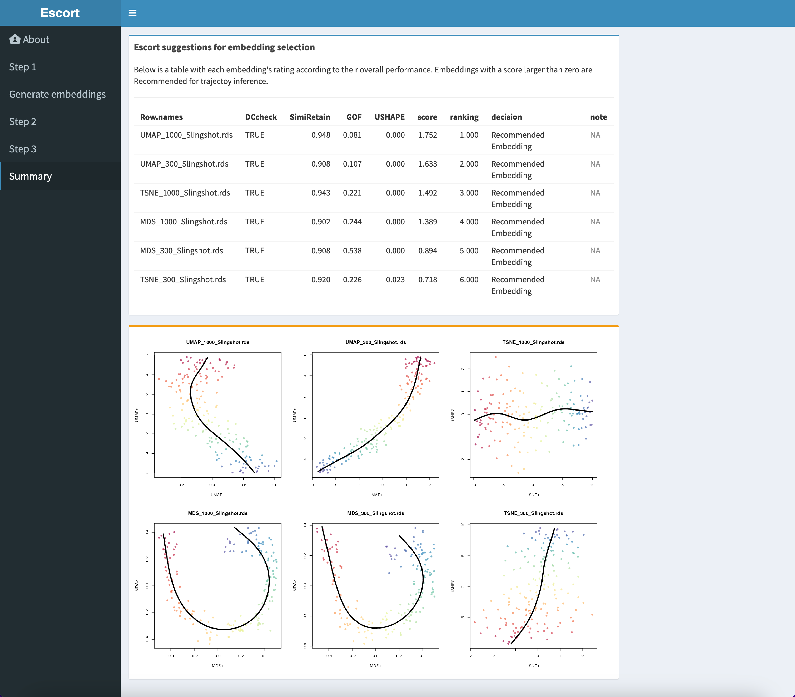

### Introduction

Welcome to shinyEscort, a user-friendly Shiny application designed to help researchers in constructing more accurate trajectories on their single-cell RNA-seq data. With shinyEscort, you input your original data and normalized data, and the application walks you through our evaluation framework.

### About
An overview of shinyEscort and the Escort workflow is provided in the "About" tab positioned at the top of the left column sidebar.

### Step 1
#### Input:
To initiate the analysis assessing the your datasets evidence of a trajectory signal, click on the "Step 1" button in the left column sidebar. Input must include  raw and normalized single-cell RNA-seq datasets in .CSV format and then click the “Import” button. Data should have undergone basic quality control removing low quanlity cells, doublets, and empty droplets. 

For hands-on practice, example datasets are stored in the data directory of the R package featuring simulated scenarios such as homogeneous data, datasets with distinct cluster types, and linear topology datasets. In this demonstration, we utilize "rawcount_linear_splatter.csv" and "normcount_linear_splatter.csv" which showcases a simulated scRNA-seq data with a linear structure.

#### Output:

**The number of cells and genes**  
Internally, Escort checks the compatibility of normalized and raw dataset to ensure they originate from the same source. If they are consistent, the number of genes and cells will be displayed. In cases where the datasets do not align or if there is any missing input data, an "NA" will be displayed in the number of genes and cells. Users should re-examine whether they input the correct datasets. 

**UMAP and t-SNE representations**  
On the right side, UMAP and t-SNE representations provide a visual representation of the datasets.  

**Existence of trajectory**  
Two scenarios considered inappropriate for trajectory inference include cells from biologically distinct clusters and sets of cells with insufficient heterogeneity. These scenarios are evaluated in the result boxes labeled "Distinct cell types" and "Homogeneous cells." The determination of trajectory existence is displayed above the UMAP and t-SNE representations.

***Diverse cell types**
In instances where the dataset fails the evaluation, detecting distinct clusters triggers a subsequent differential expression analysis utilizing the edgeR R package indicating cluster-specific genes. We display the top 30 differentially expressed genes between pairwise clusters.  Users should examine whether fitting a trajectory that connects these cell types is biologically reasonable. If so, then users should re-examine whether intermediate cell types exist, presence of batch effects, and choice of normalization method.

***Homogeneous cells**
For datasets demonstrating homogeneity, a list of highly variable genes is presented in the "HVGs" subtab, followed by a Gene Ontology (GO) enrichment analysis, and the results are presented within the "GO" subtab.Again, the appropriateness of an underlying trajectory should be considered. To proceed, users should investigate whether other processes could be overriding the biological signal on interest (e.g. cell cycle) or excessive signal from ribosomal or mitochondrial genes. Any upsream pre-processing may also need to be re-examined or eliminated. 

### Generate embeddings

#### Input:

Custom embeddings for evaluation can be generated in this tab. For now, we offer the selection of a dimension reduction technique (UMAP, MDS, PCA, or TSNE) and  the number of highly variable genes. By default, Escort utilizes Slingshot for the preliminary trajectory fitting that takes place in step 3. Users may also generate their own embedding options and skip this tab.

#### Output:

**Visualization**  
Visualize the embedding and trajectory on the left. 

**Download .rds**  
Click "Download" to save the embedding and trajectory information as an .rds file that can be uploaded in the next step.

### Step 2:

#### Input:
Next, in Step 2, users upload the .rds files generated in the prior step or generated on their own. In this demonstration, we upload six .rds files that were generated, as shown in the accompanying screenshot.

#### Output:
Escort evaluates embeddings based on inter-cellular relationships, preservation of similarity relationships, and cell density, presenting results in tables.  

**Inter-cellular relationships**  
Evaluate cell connectivity on the embedding. A result of "TRUE" followed by a checkmark "✓" indicates the absence of disconnected clusters in the embeddings.  

**Preservation of similarity relationships**  
Determine the preservation score for similarity relationships, reflecting the percentage of cells exhibiting a high level of similarity. A higher value indicates a greater number of cells performing well in preserving similarity relationships.  

**Cell density**  
Examine the distribution of cells in the embeddings. A higher value indicates a more uniform distribution in the two-dimensional embedding space. This uniformity poses challenges for trajectory inference methods in identifying a robust trajectory.

### Step 3

#### Input:
No manual input required; calculations are performed automatically once Step 2 begins.

#### Output:
Utilizing the embedding-specific trajectory, Escort estimates the proportion of cells with ambiguous projections along the trajectory, displaying the results in a table. A higher value indicates more ambiguous cells in the embeddings.

### Conclusion

#### Input:
No manual input required; calculations are performed automatically once Step 2 begins.

#### Output:
**Evaluation Table**  
Escort uses a standardized benchmark scoring system ranging from negative infinity to two. Higher scores indicate better performance. Embeddings with a score greater than zero are recommended, while those with a score less than or equal to zero are considered non-recommended. Users can easily identify optimal embedding choices for constructing a trajectory through this scoring system. The conclusive results, featuring embeddings and trajectories, are presented in a table sorted by score.  

**Representations**  
A visual representation of the top 6 highest-scoring embeddings and trajectories is plotted below the table.

